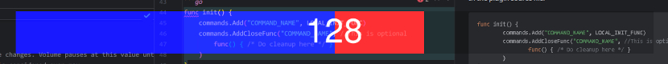

# Go Script Server

A lightweight HTTP server written in Go that executes commands via plugins using URL query parameters.

**Note**: URL query values must be URL-encoded (e.g., `+` as `%2B`, ` ` as `%20`).

Includes three default plugins: [Beep](#beep), [OpenFiles](#openfiles), [Volume](#volume).

## Table of Contents
- [Notation](#notation)
- [Installation](#installation)
- [Usage](#usage)
- [Settings](#settings)
- [Plugins](#plugins)
  - [Registering Plugins](#registering-plugins)
  - [Plugin Example](#plugin-example)
  - [Plugin List](#plugin-list)
    - [Beep](#beep)
    - [OpenFiles](#openfiles)
    - [Volume](#volume)
      - [Examples](#examples)
      - [OS Integration](#os-integration)

## Notation
- `arg.NAME`: Command-line argument.
- `param.NAME`: URL query parameter. `param.SecretKey` and `param.Command` are required.  
  Example: `https://DOMAIN:PORT/?SecretKey=xxx&Command=xxx&OtherParameter=xxx`
- `setting.SECTION_NAME.NAME`: Setting in the `SECTION_NAME` group of `settings.json`.

## Installation
1. Clone the repository.
2. In the root directory, run:
   - `go build` to create an executable, or
   - `go run script_server.go` to run directly.

## Usage
Run the server with:
```bash
./script_server <PortNumber> <SecretKey>
```
- `arg.PortNumber`: Valid TCP port for listening.
- `arg.SecretKey`: Secret key required as `param.SecretKey` in HTTP requests.

The server runs as HTTPS if `settings.Root.SSLCertificatePath` and `settings.Root.SSLKeyPath` are set; otherwise, it uses HTTP (exposing `param.SecretKey` in plaintext on the network).

Send commands via URL:  
Example: `https://DOMAIN:PORT/?SecretKey=xxx&Command=Beep`

## Settings
Stored in `settings.json`. If missing, it’s created from `settings.example.jsonc` (comments removed).

- Must be valid JSON in the format `dict[SECTION_NAME][SETTING_NAME]="VALUE"`. All values must be strings.
- Invalid or missing settings use defaults from `settings.example.jsonc`.
- File is auto-resaved on startup and after updates.

Refer to `settings.example.jsonc` for setting explanations and defaults.

## Plugins
Plugins are Go source files in the `./plugins` directory.

### Registering Plugins
In the plugin file:
```go
package plugins
import "script_server/commands"
func init() {
    commands.Add("COMMAND_NAME", COMMAND_FUNC)
    // Optional cleanup function
    commands.AddCloseFunc("COMMAND_NAME", func() { /* Cleanup code */ })
}
```

### Plugin Example
A plugin init function (`COMMAND_FUNC`) must match type `commands.CommandFunc`, taking a `commands.GetQueryValFunc` parameter and returning a string which is sent to STDOUT and the client.  
```go
// Echo the $EchoString parameter back to the client
func echoFunc(getQueryVal commands.GetQueryValFunc) string {
    if str, isFound := getQueryVal("EchoString"); isFound {
        return "Echo: " + str
    }
    return "EchoString not found"
}
```

### Plugin List
The title of the below sections is their `param.Command`.

Delete a plugin’s `plugins/*.go` file to remove it.

#### Beep
This is an example that runs a "beep" command.  
Executes `settings.Beep.ScriptLocation` via `os.exec.Command()`.  
**Warning**: Avoid plugins running arbitrary commands from query parameters due to security risks.

Example: `https://DOMAIN:PORT/?SecretKey=xxx&Command=Beep`

#### OpenFiles
Opens a multi-file-selector dialog and runs `settings.OpenFiles.ExecCommand` with selected files as arguments.  
Defaults to managing Celluloid music player playlists.

- Requires `param.OpenType`: `"Add"` or `"Open"`.
- Dialog title: `param.OpenType + " " + settings.OpenFiles.DialogName`.
- See `settings.OpenFiles` for configuration options.

Example: `https://DOMAIN:PORT/?SecretKey=xxx&Command=OpenFiles&OpenType=Add`

#### Volume
Controls global volume with a visual volume bar overlay.  


- Set volume via `param.NewVolume` (absolute or relative).
- Supports max (defaults 100%, blue) and over-max (defaults 200%, red) levels.
- Relative changes stop at max-volume for `settings.Volume.BufferSize` relative changes. This allows the volume level to naturally stop at the 100% threshold.
- If `settings.Volume.RunExtraXWinCode` is enabled:
  - The volume bar has properties:
    - Always on top
    - Mouse-pass-through
    - Non-focusable
    - Hidden from taskbar
  - If the program is crashing, try disabling this. It uses “dangerous” C functions.
  - **Note**: Compilation requires `libx11-dev`, `libxrandr-dev`, `libxinerama-dev`, `libxcursor-dev`, `libxi-dev`, `libgl1-mesa-dev`, `libglu1-mesa-dev`, `libxxf86vm-dev`
- See `settings.Volume` for configuration options.

###### Examples
- Set volume to 150%: `https://DOMAIN:PORT/?SecretKey=xxx&Command=Volume&NewVolume=150`
- Decrease volume by 4: `https://DOMAIN:PORT/?SecretKey=xxx&Command=Volume&NewVolume=-4`

###### OS Integration
This pairs well with sxhkd (Simple X hot key demon). To make alt+mouse wheel change the volume:
```bash
alt + {@button4,@button5}
    wget "https://DOMAIN:PORT/?SecretKey=SECRET_KEY&Command=Volume&NewVolume={%2B4,-4}" -O - 2>/dev/null
```